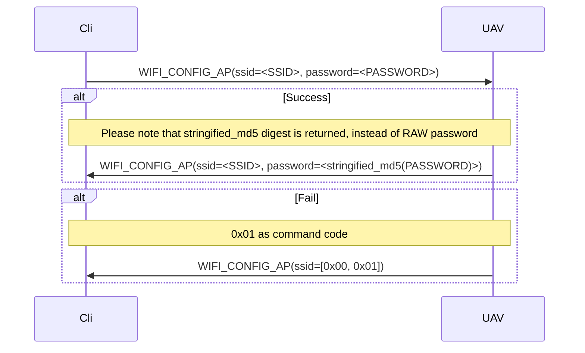
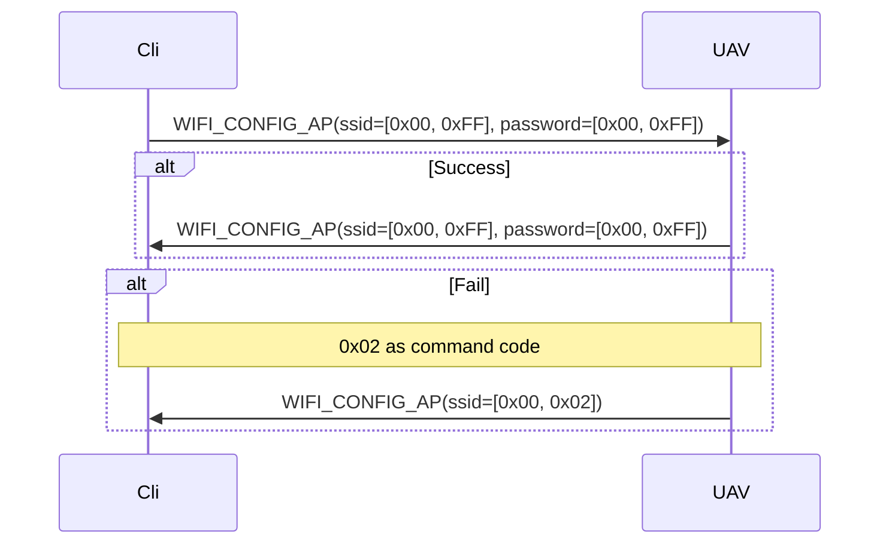
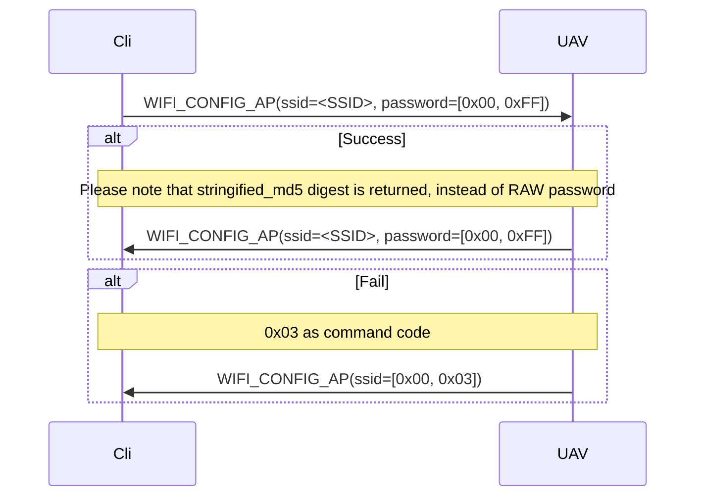
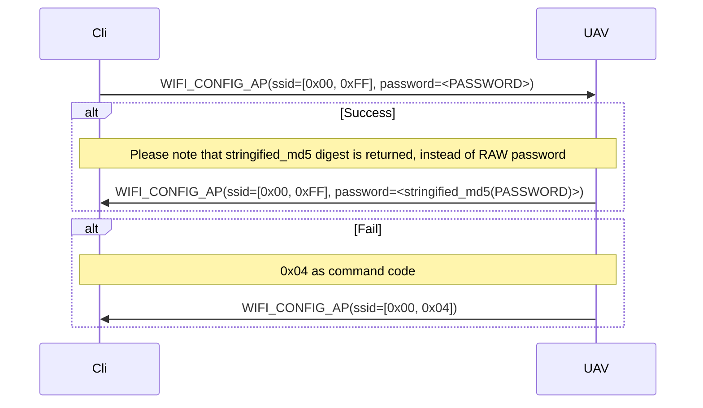
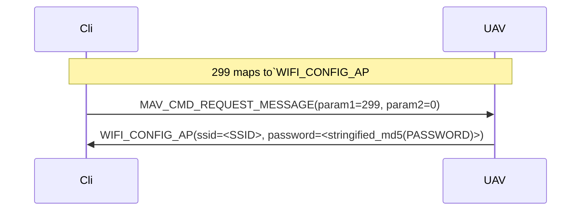
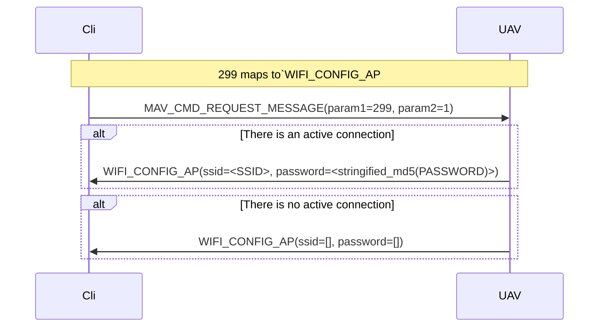

# About `mavsub` package

"Mavsub" stands for "MAVLink subprotocols".

Despite the fact that `pymavlink` provides quite comprehensive set of
marshalling, unmarshalling, and communication facilities, some
[subprotocols](http://mavlink.io/en/services/) require implementing rather
complicated message exchange sequences which better be encapsulated.  MAVLink
FTP subprotocol is one of many.  This directory contains a set of
complexity-encapsulating modules offering convenient APIs while implementing
various MAVLink subprotocols under the hood.

You are encouraged to create such encapsulations for unifying semantically and
pragmatically similar MAVLink communication sequences, such as those pertaining
to autonomous navigation, even when those are not described by MAVLink standard
as parts of some subprotocol.

When you use this approach for implementing some *vendor-specific*
functionality, please make sure that your choice for entity naming reflects the
fact that the implementation you create is not generic.

# `wifi.py`

Enables control over the vehicle Wi-Fi configurations using MAVLink protocol.
The API is quite succinct, as it is built around just one message:
`WIFI_CONFIG_AP`.
More: http://mavlink.io/en/messages/common.html#WIFI_CONFIG_AP

## Protocol description

Since MAVLink description provides no props stipulating particular use-cases,
some aspects of the use of WIFI_CONFIG_AP message are subject to interpretation.
Here is how the communication should be conducted with regard to the
implementation.

The UAV (Pioneer Mini, or Pioneer with the ESP32-based extension module)
provides facilities enabling user to connect the vehicle to an external Wi-Fi
network, while still having it operating as an access point (AP), or change
SSID and password of the Wi-Fi Access Point which the UAV serves as.

### Standard / implementation mismatch

PyMavlink and "Android MAVLink" implementations do not support the MAVLink 2.0's
version of `WIFI_CONFIG_AP` message. In order to accomodate both AP and
STA-related functionality within the confinements of the same standard (MAVLink
1.0), a few alternations to the protocol were made.

### Stringified MD5

Stringified MD5 is an ASCII string that mimics HEX number representation.  The
standard requires `password` field to be of type `char`. MAVLink distinguishes
between `char` and `int8_t`, hence the use of stringification.

```python
non_smoker_hex = b"\x00\x01\xfe"
smoker_hex = "0001fe"
```

### Connect to an external access point (STA mode)



### Disconnect from an external access point (STA mode)



### Change SSID (AP mode)



### Change password (AP mode)




### Request AP status

A user may send `MAV_CMD_REQUEST_MESSAGE`, to retrieve the UAV's current Wi-Fi
configuration.




### Request STA status


