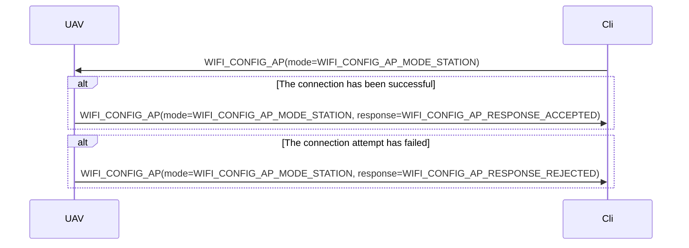
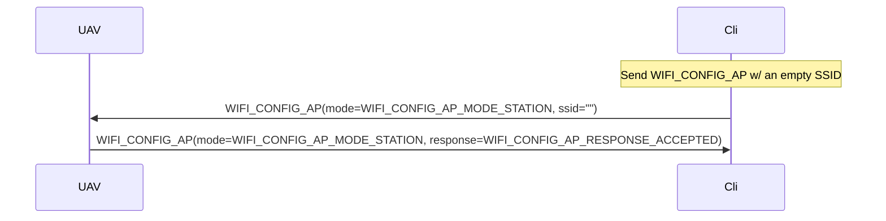

# About `mavsub` package

"Mavsub" stands for "MAVLink subprotocols".

Despite the fact that `pymavlink` provides quite comprehensive set of marshalling, unmarshalling, and communication facilities, some [subprotocols](http://mavlink.io/en/services/) require implementing rather complicated message exchange sequences which better be encapsulated.
MAVLink FTP subprotocol is one of many.
This directory contains a set of complexity-encapsulating modules offering convenient APIs while implementing various MAVLink subprotocols under the hood.

You are encouraged to create such encapsulations for unifying semantically and pragmatically similar MAVLink communication sequences, such as those pertaining to autonomous navigation, even when those are not described by MAVLink standard as parts of some subprotocol.

When you use this approach for implementing some *vendor-specific* functionality, please make sure that your choice for entity naming reflects the fact that the implementation you create is not generic.

# `wifi.py`

Enables control over the vehicle Wi-Fi configurations over MAVLink protocol.
The API is quite succinct, as it is built around just one message:
`WIFI_CONFIG_AP`.
More: http://mavlink.io/en/messages/common.html#WIFI_CONFIG_AP
Also, for the details of a particular implementation, refer to `./README.md`

## Protocol description

Since MAVLink description provides no props stipulating particular use-cases,
the use of the message is subject to interpretation. Here is how the
communication should be conducted with regard to the implementation.

### Change Wi-Fi STA connection.

The UAV (Pioneer Mini, or Pioneer with the ESP32-based extension module)
provides facilities enabling user to connect the vehicle to an external Wi-Fi
network, while still having it operating as an access point (AP).

#### Connect to an external access point (STA mode)



#### Disconnect from an access point (STA MODE)

Similar to the connection procedure, but w/ an empty `ssid` field.



### Change AP configs (AP mode)

#### Change SSID or password

*As per 2022-12-02, the password changing functionality is yet to be
implemented. Coming soon.*

```mermaid
sequenceDiagram
	participant UAV
	participant Cli
	Cli ->> UAV: WIFI_CONFIG_AP(mode=WIFI_CONFIG_AP_MODE_AP, ssid="Less Than 32 Symbols")
	UAV ->> Cli: WIFI_CONFIG_AP(mode=WIFI_CONFIG_AP_MODE_AP, response=WIFI_CONFIG_AP_RESPONSE_ACCEPTED)
````

#### Request a missing message

What to do if a response message has been missed.

*Coming soon*
